# SchoolPay - MERN Stack School Payment System

A Full Stack microservice for a School Payment and Dashboard Application.

SchoolPay is a full-stack school payment system built with MERN (MongoDB, Express, React, Node.js). It allows students to make payments securely, track transaction statuses, and integrates with the Edviron payment gateway.

---

## Table of Contents
- [Description](#description)  
- [Features](#features)  
- [Tech Stack](#tech-stack)  
- [Project Structure](#project-structure)  
- [Installation](#installation)  
- [Usage](#usage)  
- [Webhook Testing](#webhook-testing)  
- [Deployment](#deployment)  
- [Contributing](#contributing)  
- [License](#license)  

---

## Description

SchoolPay provides a secure platform for students to make payments, check their transaction statuses, and allows admins to manage users and payments. The system integrates with the Edviron payment gateway and includes JWT authentication, dashboard with quick actions, and responsive UI built with Tailwind CSS.

---

## Features

- [Student Authentication]: Secure login and registration system with JWT-based authentication. Includes password visibility toggle and secure session management.  
- [Dashboard]: Personalized welcome message with quick action cards for easy navigation. Quick actions include:
  - Pay Now → Redirect to payment page
  - Check Status → View payment history  
- [Payment Processing]: Create payments with student details and redirect to Edviron payment gateway. Dynamic payment card shows transaction details.  
- [Status Tracking]: Check payment history and transaction status in real-time.  
- [Admin Panel]: Manage users and transactions (admin access only).  
- [Webhook Handling]: Automatic payment status updates from Edviron via webhook.  
- [Error Handling & Loading States]: Spinner components for async actions and user-friendly error messages.  
- [Responsive Design]: Modern, mobile-friendly UI built with Tailwind CSS, responsive cards, buttons, and forms with smooth hover and transition effects.  

---

## Tech Stack

- **Frontend:** React, React Router, Tailwind CSS, Heroicons  
- **Backend:** Node.js, Express  
- **Database:** MongoDB (Mongoose)  
- **Authentication:** JWT  
- **Payments:** Edviron API integration  
- **Other:** Axios, dotenv, uniqid, cookie-parser, CORS  

---

## Project Structure

backend/
├── config/
│ └── mongoose-connection.js
├── models/
│ ├── order-model.js
│ └── user-model.js
├── routes/
│ ├── usersRouter.js
│ ├── adminsRouter.js
│ ├── paymentRouter.js
│ ├── transactionRouter.js
│ └── webhookRouter.js
├── controllers/
│ └── paymentController.js
├── scripts/
│ └── createAdmin.js
├── .env
└── server.js

frontend/
├── src/
│ ├── Components/
│ │ └── Spinner.jsx
│ ├── Pages/
│ │ ├── Login.jsx
│ │ ├── Dashboard.jsx
│ │ └── PaymentForm.jsx
│ ├── Services/
│ │ └── Axios.js
│ └── App.jsx

---

## Installation

### Backend

1. Navigate to backend folder:
```bash
cd backend
Install dependencies:
```
```
npm install
```
2. Setup environment variables in .env:

```
PORT=5000
MONGO_URI=your_mongodb_uri
CLIENT_URL=http://localhost:5173
SCHOOL_ID=your_school_id
TRUSTEE_ID=optional_trustee_id
BASE_URL=http://localhost:5000
API_KEY=your_edviron_api_key
PG_KEY=your_jwt_secret
Start backend server:
```

```
npm run dev
```

### Frontend
1. Navigate to frontend folder:

```bash
cd frontend
Install dependencies:
```
```
npm install
```
2. Start frontend server:
```
npm run start
Frontend will be available at http://localhost:000
```
```
Backend will run at http://localhost:000
```

## Usage
Students can register and log in.
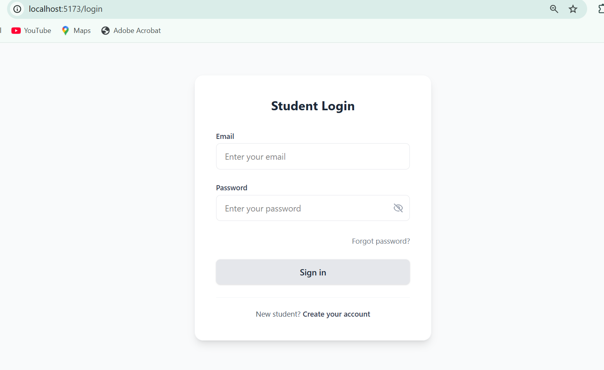
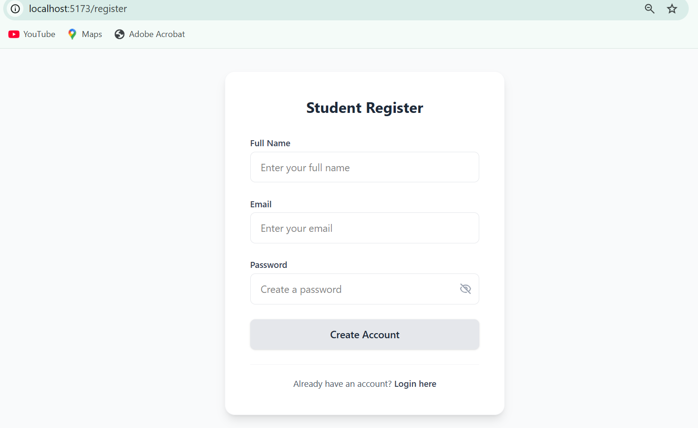


Studemts Dashboard options allow:
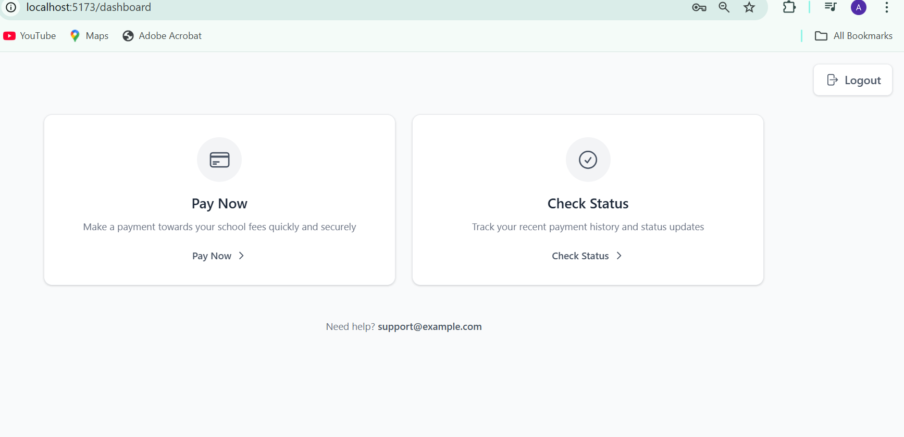


Create payment → redirected to Edviron payment link.
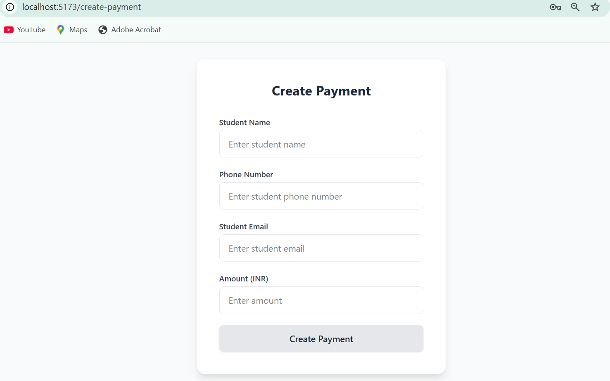

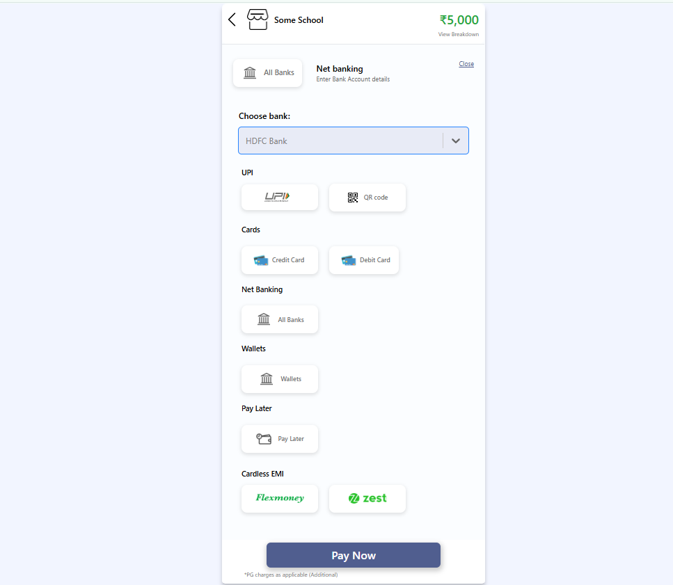
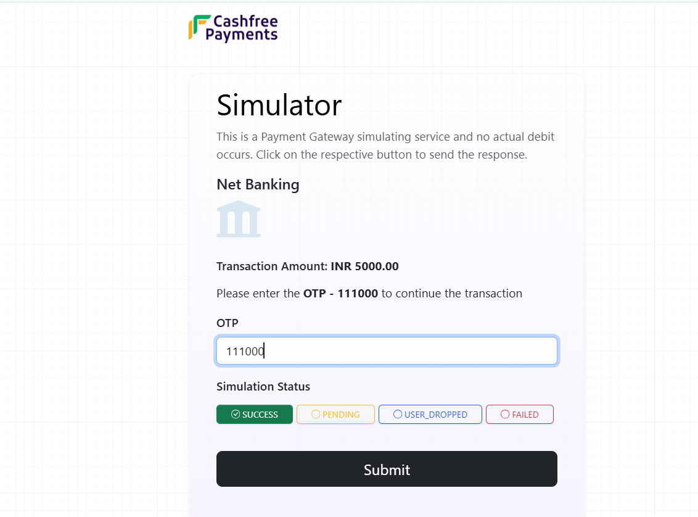

Check payment status → view payment history.
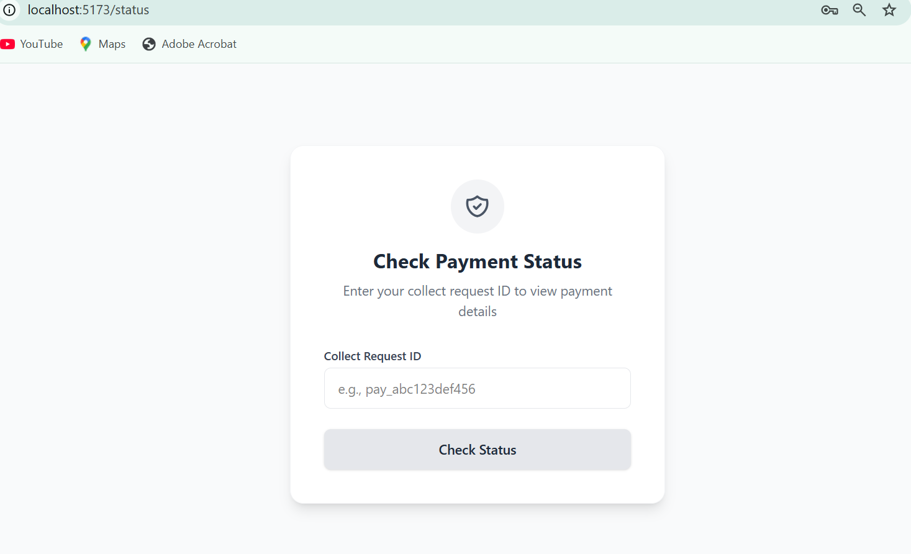
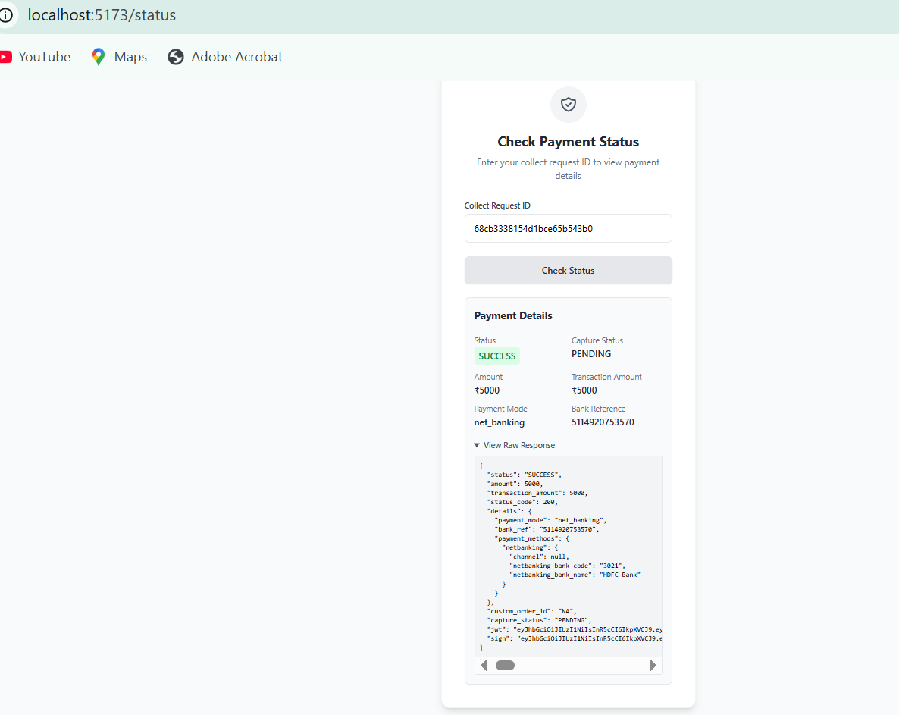

## Admins
1. Create admin via backend script:

```bash
node scripts/createAdmin.js
```

2. Admin login route: /admins/auth/login
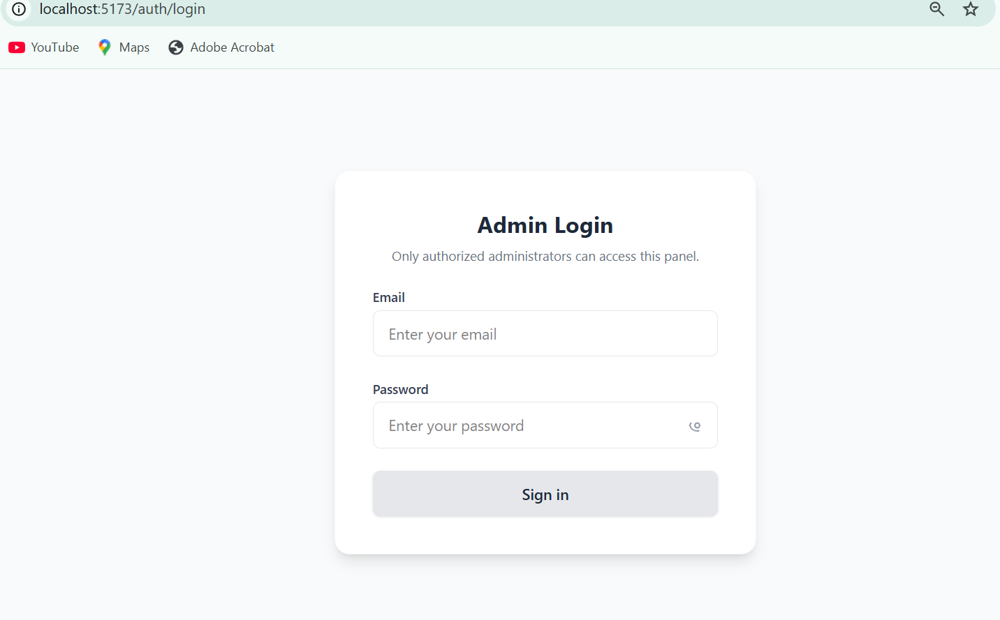

3. Admin dashboard: http://localhost:5173/admin/dashboard

- White Mode
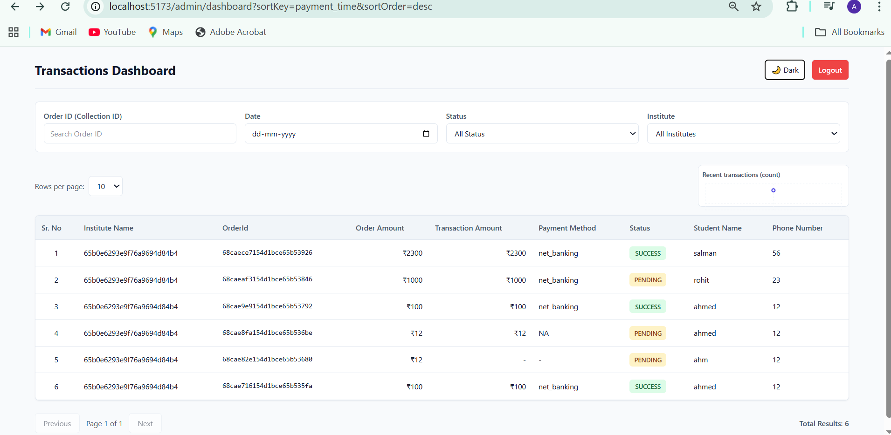

- Black Mode
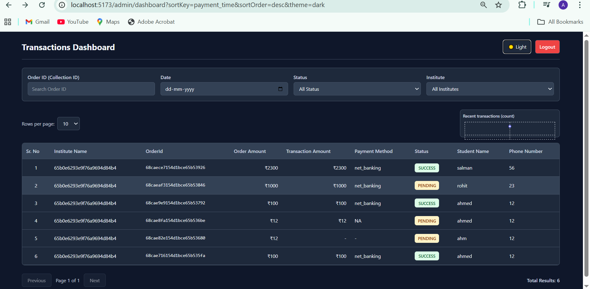


### Webhook Testing
Since Edviron support dynamic webhook URLs, you can test locally using Postman:

- POST payload to:

```bash
POST http://localhost:5000/webhooks
```

- Sample JSON:

```
{
  "status": 200,
  "order_info": {
    "order_id": "collect_id",
    "order_amount": 2000,
    "transaction_amount": 2000,
    "gateway": "PhonePe",
    "bank_reference": "YESBNK222",
    "status": "success",
    "payment_mode": "upi",
    "payment_details": "success@ybl",
    "payment_message": "payment success",
    "payment_time": "2025-09-17T12:00:00.000Z"
  }
}
```
***Verify that MongoDB order status updates correctly.***

### Deployment
- Deploy backend on Render / Railway / Heroku.

- Deploy frontend on Vercel / Netlify.

- Update .env with production URLs.

- Webhooks will work automatically in deployed backend.

- Contributing
### Fork the repository.

Create a feature branch:

```bash
git checkout -b feature-name
Commit your changes:
```
```
git commit -m "Description"
Push to branch:
```
```
git push origin feature-name
Open a Pull Request.
```


### License
- MIT License.
- Feel free to use and modify for personal or educational projects.


